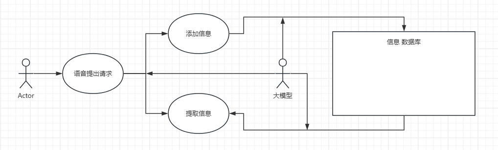
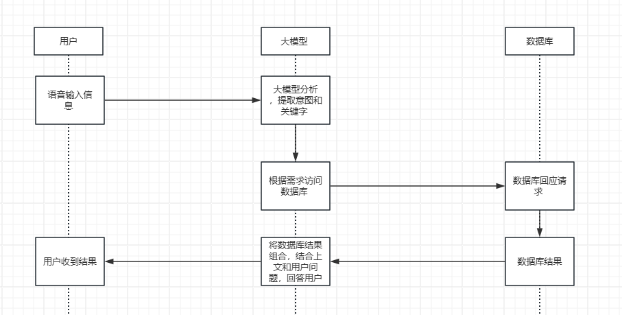

# 
 智能语音助手 需求分析文档 

## 1. 摘要

### 1.1 适用对象

有大量零碎信息，需要收集到知识库中，并需要友好的人机交互方式来提取这些信息的用户群体。

### 1.2 业务背景 

辅导员需要收集学生情况，以及能快速的检索目标学生的历史需求。常规环境下，辅导员需要手动去管理文档、做备忘录等来记录信息，这是十分不便的。我们的软件应该能极大方便辅导员进行信息管理。

### 1.3 实现范围

实现版本：HTML/python

### 1.4 重要说明

暂无

## 2. 业务流程

### 2.1 用例图

### 2.2 业务流程图

## 3. 用例详细描述  

### 3.1 前端部分 

为了简化部署难度，使用HTML网页来搓前端，风格上与常见的大模型网站保持一致，用人机交互友好的对话框来进行交互。

### 3.2 后端部分 

使用基底大模型构建agent框架，语音api提取到的文字输入，让大模型对文字进行关键词提取，分析用户是要做什么，是存储信息，还是询问信息。然后进入分支结构，对数据库进行访问操作，接受数据库的回应，作为新的提示词组合起来，回馈给大模型得到最后的回答，再次通过语音api回答用户。

### 3.3 数据库部分

存储有关学生的信息等，各种非结构化信息，作为一个独立的知识库存在。

### 3.4 环境部署部分

尽可能简化部署难度，减少性能损失。

## 4. 补充说明

暂无